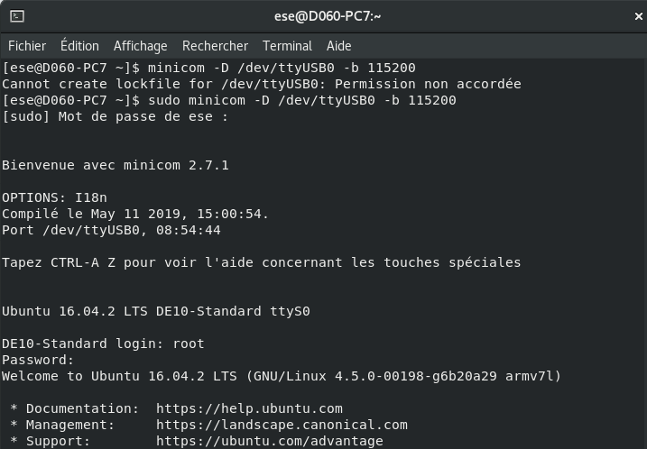
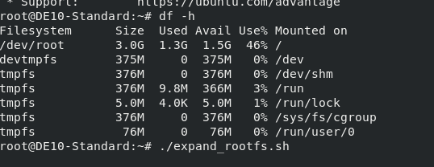
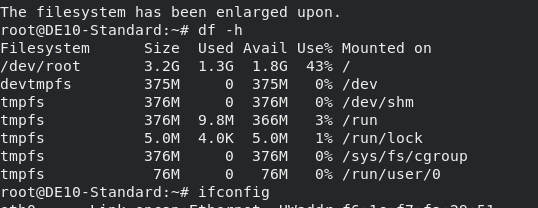
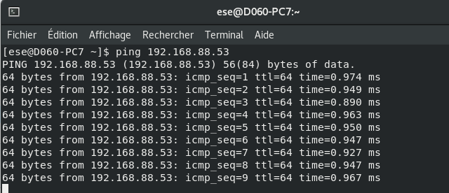
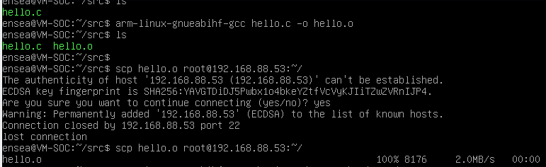
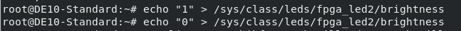
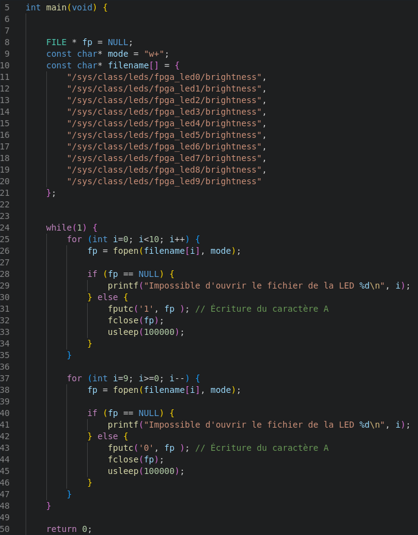

# TP_Linux_Embarqué

## 1 Prise en main
### 1.3 Connexion au système

On se connecte au SoC:

On a une taille de 3.0G qui est occupé:

Après modification, on a bien 3.2G max qu'on peut occuper.

Puis on configure son réseau avec vim, puis on ping le 192.168.88.53:

### 1.4 Découverte de la cible

On réalise un programme hello world, puis on le test sur la carte:

Ensuite on test d'allumer/eteindre la led : 

On réalise un programme chenillard en mode download, puis on le test sur la carte:

## 2 Modules kernel
### 2.0 Reprise TP1

On revérifie l'execution avec scp du chenillard. On voit bien le chenillard.

### 2.1 Accès aux registres

Ici on dévellope un driveur en mode utilisateur, on a pas d'interruption. Le coden'est pas portable.

### 2.3 CrossCompilation de modules noyau

On lance les lignes suivantes :
export CROSS_COMPILE=<chemin_arm-linux-gnueabihf->
export ARCH=arm
make prepare
make scripts

Ca creer un symbole pour l'instance de terminal.
Vu qu'il s'agit d'un préfix devant gcc, il faut un tiret pour que la commande comprenne prefix + gcc.
